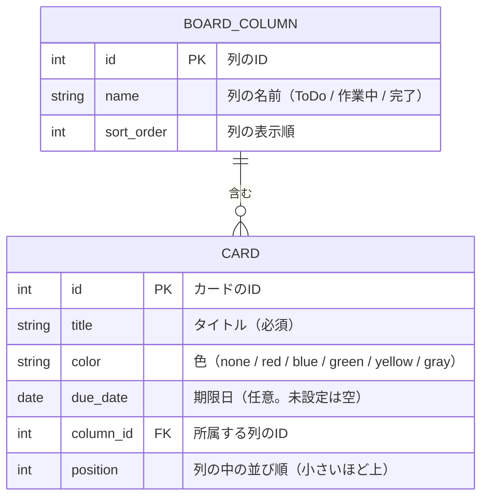

# データ設計

アプリが保存するデータの構造を定める。
現時点では、データベースの種類に依らない概念レベルの設計とし、型や名前の細部は、技術スタックの決定後に確定する（[技術スタック](tech-stack.md) を参照）。

## 1. ER図

## 2. データの説明

### 2.1 列（BOARD_COLUMN）
- 現時点では、ToDo / 作業中 / 完了 の3つに固定する
- 将来、「確認待ち」列を追加できるよう、列をデータとして保持する

### 2.2 カード（CARD）
| 項目 | 内容 | 必須 | 関連する要件 |
|---|---|---|---|
| title | カードのタイトル | 必須 | カードの追加・タイトルの修正 |
| color | カードの背景色。初期値は none（色なし） | 必須 | 色の変更 |
| due_date | 期限日。未設定の場合は空 | 任意 | 期限日の設定、期限順の並び替え、期限切れの赤文字表示 |
| column_id | カードが入っている列 | 必須 | 列の間の移動 |
| position | 列の中での並び順 | 必須 | 同じ列の中での並び替え、並び順の保存 |

## 3. データに関する決めごと
- 新しいカードは、その列の一番上に入る（position が最も小さくなる）
- カードを動かしたとき、動かした先の列の並び順を更新する
- 期限順に並び替えたときは、その結果を position に反映して保存する
- 期限日のないカードは、期限順で末尾に並べる
- 期限切れの判定は、表示のときに「期限日が今日より前で、完了列以外」かどうかで行う（データには持たない）
- バックアップファイルには、列とカードの全項目を含める

## 4. 今後確認する事項
- 並び順の持ち方（連番にするか、間を空けた数値にするか）。技術スタックの決定後に検討する
- 列の追加・名前の変更を、将来どこまで許すか
